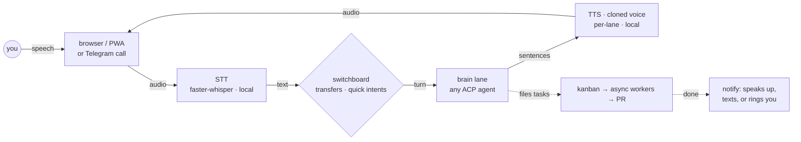

<p align="center">
  <picture>
    <source media="(prefers-color-scheme: dark)" srcset="assets/logo-dark.svg">
    <source media="(prefers-color-scheme: light)" srcset="assets/logo-light.svg">
    
  </picture>
</p>

**Cicero is a self-hosted voice interface for coding agents: you speak, it answers out loud, and your agent does the actual work.** Install it next to the agent you already use — Claude Code, Codex, Gemini, an [ACP](https://agentclientprotocol.com) harness like [hermes](https://hermes-agent.nousresearch.com), or any OpenAI-compatible endpoint — then talk to that agent from any browser on your network — or, with the optional Telegram sidecar, over a real phone call. Say *"fix the failing auth test and open a PR"*; Cicero acknowledges in about a second, the work happens in the background (commands you've gated, like a `git push`, need your spoken yes), and it tells you when the PR is up. With local providers, your audio never leaves your machine.

**Local voice in, pull requests out.** In more detail:

- **~1 second to first spoken word** (on a local NVIDIA GPU) — local [faster-whisper](https://github.com/SYSTRAN/faster-whisper) speech recognition, sentence-streamed speech synthesis, latency-covering filler clips. Measured end-to-end through a real tool-calling agent, not a parrot.
- **Any voice, cloned locally** — zero-shot cloning from a single reference WAV, down to **36–46 ms per sentence** ([audio.cpp](https://github.com/0xShug0/audio.cpp) pocket-tts, ggml/CUDA). Hand it a clip; that's Cicero's voice now.
- **Interrupt it mid-sentence** ("barge-in") — talk over Cicero on the browser and phone paths (and on the local mic when you enable full-duplex) and speech stops while cancellable brain adapters receive the interrupt; terminal-UI injection translates it to a bounded, best-effort terminal control. Only *speech* interrupts: a small local VAD model confirms a human is talking before anything cuts Cicero off, so keyboard clatter and background music don't — and with hands-free auto-start, the dormant page itself wakes when you speak. (Honest label: turn-taking with fast interruption — not a speech-to-speech model that comprehends while talking.)
- **Knows when you're done talking** — opt-in semantic end-of-turn detection ([Smart-Turn](docs/turn-detection.md), the same approach ChatGPT and Gemini voice use, here fully local): a tiny model (~8 M params, ~12 ms on CPU) reads the prosody and completeness of what you said instead of just timing the pause — so it can answer as soon as your sentence is complete instead of waiting out a silence timer, and keeps the mic open when you trail off mid-thought. Works on the browser path and the local mic; one `turn:` block in the config enables it.
- **Hears *how* you said it** — an optional speech-emotion sidecar ([emotion2vec](https://github.com/ddlBoJack/emotion2vec), CPU-only) classifies your tone in parallel with transcription and passes a confident non-neutral read to the agent — it knows the difference between "great" and *"great."* — at ~0 ms added latency, fully local.
- **A whole office behind one call** — lanes give you a team of agents, each with its own voice and personality: *"let me talk to the coder"* transfers the call, *"roll call"* makes everyone check in. Cicero speaks up on its own too: task finished, morning briefing, quiet hours respected.
- **Agent-agnostic by design** — the brain is a pluggable slot. Cicero owns the voice; your agent owns the doing.

---

## Words we use

Six terms cover most of the docs:

| Term | Meaning |
|---|---|
| **brain** | The coding agent that does the thinking — Claude Code, Codex, Gemini, an ACP harness. Cicero is the voice wrapped around it, and ships no brain of its own. |
| **barge-in** | Talking over Cicero. It stops speaking and listens. |
| **lane** | One brain + voice + personality. |
| **the office** | Several lanes behind one call: *"let me talk to the coder"* transfers you, *"back to Cicero"* returns. |
| **sidecar mode** | The lightweight mode: Cicero attaches to an agent session you already run and speaks its replies. No models, no config. |
| **daemon mode** | The full product: browser / phone / local mic in, a brain in the middle, a cloned voice out. |

> **Project status:** Active development. Web-voice, daemon, and sidecar modes work today; the [evaluation follow-up](docs/evaluation-follow-up-2026-07.md) records current limits. Files under `docs/superpowers/plans/` and `docs/superpowers/specs/` are historical design records, not the current backlog.

## How a turn flows



Replies stream sentence-by-sentence, so speech starts while the brain is still generating. Heavy work runs *outside* the voice loop: the agent files it on its board, workers build and open the PR async, and Cicero tells you when it lands. Details in [architecture](docs/architecture.md).

---

## What you'll need

- **An OS.** Linux is the reference setup, with an NVIDIA GPU (CUDA) or plain CPU; macOS 14+ on Apple Silicon and Windows (CUDA) are supported — see [setup](docs/setup.md) for those paths.
- **A GPU is recommended, not required.** The latency numbers above come from an NVIDIA card. On Linux, everything also runs on CPU: transcription gets noticeably slower, but the default voice engine (pocket-tts) is CPU-friendly at roughly half a second per sentence. On Apple Silicon (measured on an M4), the local MLX stack transcribes a spoken command in about a second and pocket-tts runs ~0.4 s per sentence (≈9× realtime) — see [stored results](docs/performance-portability-evaluation.md#stored-results--apple-silicon-m4) for the measured numbers.
- **Disk and patience for first start.** The speech models and the small local LLM download on first use — expect a few GB.
- **Tools:** [Bun](https://bun.sh) (the runtime), [uv](https://docs.astral.sh/uv/) (manages the Python model servers), ffmpeg, [Ollama](https://ollama.com) (runs the small local router model), and OpenSSL (used once, to create the HTTPS certificate).
- **A coding agent, installed and authenticated.** Cicero ships no brain — bring Claude Code, Codex, Gemini, or any ACP/OpenAI-compatible harness.

## Try it in two minutes (sidecar mode)

The zero-commitment path — no GPU, no model downloads, no config file. If you already use Claude Code or Codex, clone this repository, `cd` into it, and run:

```bash
bun install && bun link                 # expose the `cicero` CLI from this checkout
sudo apt install speech-dispatcher      # Linux only: the system voice (macOS has `say` built in)
cicero hook install claude-code         # or: cicero hook install codex
cicero hook                             # leave running in a second terminal
```

Every hooked session now speaks its responses out loud — in your plain system voice until you add a real TTS engine, and the response's last line until you point Cicero at a local LLM for summaries. Codex asks you to trust a newly installed command hook in `/hooks`; terminal-scrape mode remains available for Gemini and agents without native hooks. Details are in [setup → sidecar quickstart](docs/setup.md#sidecar-quickstart-claude-code-and-codex).

## The full setup (web voice)

The flagship shape: Cicero on a Linux box (GPU or not), you talking to it from any browser on your network.

**1. Install the prerequisites** (skip any you have):

```bash
curl -fsSL https://bun.sh/install | bash            # Bun
curl -LsSf https://astral.sh/uv/install.sh | sh     # uv
sudo apt install ffmpeg openssl                     # Debian/Ubuntu (brew/scoop elsewhere)
curl -fsSL https://ollama.com/install.sh | sh       # Ollama (other platforms: https://ollama.com/download)
```

**2. Get Cicero and its speech servers.** Clone this repository, `cd` into it, and run everything below from that checkout (the daemon launches and supervises the model servers itself):

```bash
bun install
bun link                    # expose the `cicero` CLI from this checkout

uv venv .venv-stt --python 3.10
uv pip install --python .venv-stt -r requirements/faster-whisper.txt
uv venv .venv-pocket --python 3.11
uv pip install --python .venv-pocket -r requirements/pocket-tts.txt
ollama pull qwen3.5:4b
```

**3. Create the config.** Make `~/.cicero/config.yaml` with exactly this content (don't copy `config.yaml.example` for a first run — it documents every option and expects backends this quickstart doesn't install):

```yaml
# ~/.cicero/config.yaml — the minimal web-voice setup
headless: true
web_voice: { enabled: true, host: 0.0.0.0, port: 8090 } # a fresh token prints at startup
stt: { backend: faster-whisper, port: 8083, model: large-v3-turbo }
tts: { backend: pocket-tts, port: 8095, voice: alba }
llm: { backend: ollama, port: 11434, model: qwen3.5:4b }
brain: { backend: claude-code, mode: subprocess } # or acp / codex / gemini / ollama / any OpenAI-compatible URL
```

**4. Pick your brain.** The config above expects the Claude Code CLI — install it and log in before continuing. For Hermes or another ACP harness, set `brain: { backend: acp, binary: …, binary_args: […] }` instead — see [Brains](docs/brains.md).

**5. Check, start, talk:**

```bash
cicero doctor   # checks configured backends and prints fixes
cicero start
# → 🎙️  Web voice server on https://0.0.0.0:8090 (token required)
```

Open `https://<box-ip>:8090/?token=<token>`, accept the self-signed certificate once, hold SPACE (or the orb), and talk. Full page controls, hands-free mode, and the PWA install are in the [web-voice guide](docs/web-voice.md); macOS / Windows / systemd / remote-GPU setups in [setup](docs/setup.md).

## When something doesn't work

- **The browser warns about the certificate.** Expected: Cicero generates a self-signed HTTPS certificate on first start (browsers only expose the microphone over HTTPS). Accept it once per device.
- **Where's the token?** Printed at startup, once per run. For a stable token across restarts, run `openssl rand -hex 16` and paste only its output as `token:` inside the `web_voice:` block (e.g. `web_voice: { enabled: true, host: 0.0.0.0, port: 8090, token: <paste> }`). Configure it before running Cicero under a service manager, because startup stdout may be retained — and never copy an example placeholder as a secret.
- **I talk and nothing happens.** The default is push-to-talk: hold SPACE or the orb *while* speaking. Then check the browser's microphone permission, then `cicero doctor`.
- **`doctor` is green but turns fail.** `doctor` verifies configuration and binaries; it does not prove a CLI login or complete a live agent turn. Make sure the brain's own CLI works standalone, then exercise one real turn.
- Anything else: `cicero doctor` first — it names the missing prerequisite and the command that fixes it.

---

## What you can do with it

- **Delegate real work by voice** — "fix the failing auth test and open a PR" gets acked in a second, built async, and announced when the PR is up. [The office →](docs/office.md)
- **Talk to a team, not a bot** — per-lane agents with their own memory, voice, and personality; sticky transfers; roll call; standups read from the task board. [Lanes →](docs/office.md)
- **Clone any voice you're authorized to use** — add one WAV for a supported provider, then `voice use` selects that provider and its safe reference or cloud ID end to end; per-employee voices can mix clones and presets. [Voice cloning →](docs/voice-cloning.md)
- **Let it reach you** — proactive speech in the browser, Telegram voice notes, or a real phone call; quiet hours queue the news and the morning briefing reads it back — once, at *your* 8:30. Scheduled prompts go the other way: give a lane a prompt and a time in the config and it briefs you daily on whatever you asked. [Notifications →](docs/notifications.md)
- **Follow up without re-explaining** — every delivered notification is also handed to the brain as context for your next turn: Cicero says a PR got a review comment, you answer *"take care of it"*, and the agent knows what *it* refers to. [Notifications →](docs/notifications.md)
- **Log life in passing** — text the bot `log calories 650` or `log weight 82.4` and it appends to a local health record instantly, no agent turn; `cicero health recent|trend` reads it back, and `POST /api/health` bridges phone automations. [Notifications →](docs/notifications.md)
- **Summon the call by voice** — say *"call me"* (or *"have Ada call me"*) on any voice surface and your phone rings via the Telegram sidecar. Intent, not wording: a small local classifier rings on *"I want you to call me"* but just answers *"did you call me?"*. [Notifications →](docs/notifications.md)
- **Keep the sharp edges gated** — destructive tool calls are denied fail-closed until you approve them out loud. [Confirmation gate →](docs/brains.md)
- **Take it off the leash** — `cicero do "<goal>"` runs local tool-use with spoken confirmation on anything mutating. [Computer use →](docs/daemon-mode.md)

---

## How it compares

Cicero's differentiator is the combination of local STT, local cloned-voice
TTS, hot-mic barge-in, semantic turn detection, and delegation to autonomous
coding agents:

- **Compared with voice-chat stacks**, Cicero connects the conversation to a
  tool-using agent so turns can end in work products such as tasks, branches,
  and PRs.
- **Compared with agent orchestration tools**, Cicero supplies the capture,
  interruption, synthesis, and notification layer while leaving the chosen
  agent in charge of the work.
- **Compared with cloud realtime speech APIs**, Cicero can keep STT and TTS on
  hardware you control and treats the brain as a replaceable adapter.

Cicero also acts as a real-time voice client for any
[Agent Client Protocol](https://agentclientprotocol.com)-speaking harness —
a live, interruptible spoken conversation, not transcribed voice messages.

---

## Docs

- [Setup](docs/setup.md) — Linux / macOS / Windows install, sidecar quickstart, remote model servers, systemd, CLI reference
- [Web-voice mode](docs/web-voice.md) — the browser/PWA experience: controls, hands-free, barge-in, restart resume
- [The office](docs/office.md) — lanes, transfers, personas, the operator pattern, an example team topology
- [Brains](docs/brains.md) — every backend, verified ACP harnesses, the spoken confirmation gate, bring-your-own-harness
- [Notifications](docs/notifications.md) — proactive voice-back, kanban watch, Telegram notes & calls, quiet hours + briefing
- [Turn detection](docs/turn-detection.md) — semantic end-of-turn (Smart-Turn): why silence timers cut you off, the model server, tuning
- [Voice cloning](docs/voice-cloning.md) — the library, engines and latencies, getting a clone to sound right
- [Daemon mode](docs/daemon-mode.md) — local mic, full-duplex, double-clap, computer use
- [Configuration](docs/configuration.md) — full config reference, default model stacks, quick intents, custom actions
- [Architecture](docs/architecture.md) — the turn pipeline, components, where your data lives
- [Full duplex](docs/duplex.md) — why Cicero takes turns: the fused-vs-modular tradeoff, and what would change the call
- [Security model](docs/security.md) — the threat model, the token, TLS, what egresses and what never does
- [Evaluation follow-up](docs/evaluation-follow-up-2026-07.md) — delivered fixes, current limits, and intentional architecture boundaries

---

## Development

```bash
bun test                  # full test suite
bun run dev               # dev mode with watch
```

The default suite does not contact external agent services, even when `.env`
contains credentials. To run the opt-in Claude CLI smoke test, install and
authenticate Claude Code, then run:

```bash
CICERO_LIVE_TESTS=1 bun test tests/brain-claude-code-stream.test.ts
```

## License

MIT — see [LICENSE](LICENSE). Voice cloning is BYO-voice: Cicero ships no third-party voices, and cloning someone without consent is on you, not the tool — see [authorized use](docs/voice-cloning.md#authorized-use-only).
